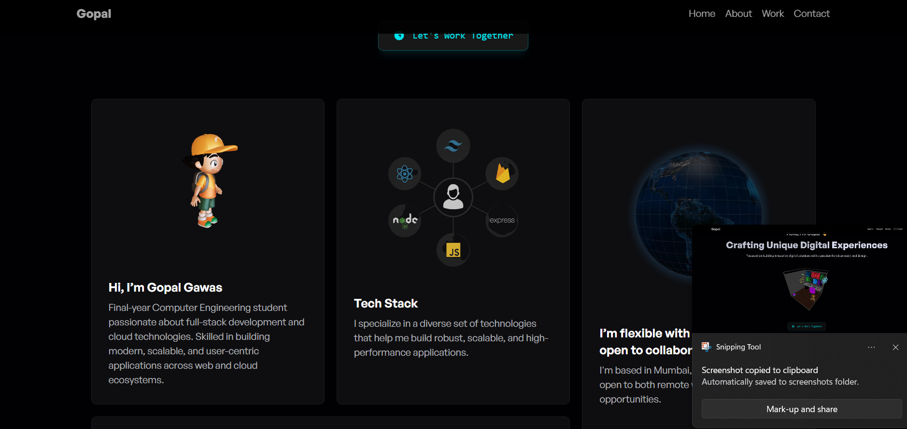

<div align="center">

# 🌐 Personal Portfolio  
### A Modern Developer Portfolio Built with React + Tailwind + Animations ✨  


<br/>

<a href="https://portfolio-ten-flame-41.vercel.app/" target="_blank">

</a>


</div>

---

## 🚀 Overview

My personal developer portfolio built using **React + Tailwind CSS** with smooth transitions, animations, and responsive design to showcase my skills & work beautifully.

---

## ✨ Features

✔ Fully Responsive  
✔ Modern UI  
✔ Tailwind Animations  
✔ Project Showcase  
✔ Smooth Navigation  
✔ Contact Section  
✔ Social Links  

---

## 🛠 Tech Stack

| Category | Technologies |
|--------|--------------|
| Frontend | React, Tailwind CSS |
| UI | Framer Motion |
| Tools | Git, GitHub, VS Code |
| Hosting | Vercel |

---

## 📸 Screenshots  

> Add screenshots folder  
```bash





